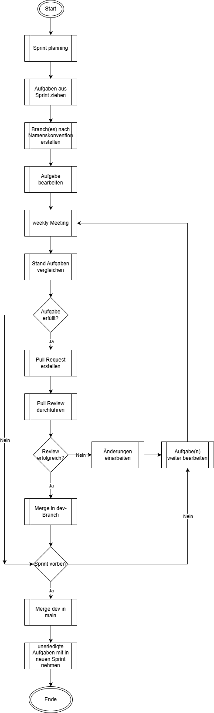

include::../docs/_includes/default-attributes.inc.adoc[]
// --- 1. Projektthema -------------------------
= SE II - Reflexion: {project-name}

// ---
:doctype: book
:toc:
:toclevels: 2
:toc-title: Inhaltsverzeichnis
:sectnums:
:icons: font
//:source-highlighter: highlightjs
:source-highlighter: rouge
:rouge-style: github
:xrefstyle: full
:experimental:
:chapter-signifier:
:figure-caption: Abbildung
:table-caption: Tabelle
:listing-caption: Listing
:!example-caption:
// Folders
:imagesdir-reset: {imagesdir}
:docs-test2: {docs}/test2
:docs-requirements: {docs}/requirements
:docs-project-management: {docs}/project_management
:docs-architecture: {docs}/architecture
:docs-test: {docs}/test
:docs-development: {docs}/development

== Gruppenleistung

=== Erfolg: Effektive Teamzusammenarbeit durch flexible Arbeitsorganisation

Ein zentraler Erfolg des Projekts war die sehr gute Zusammenarbeit innerhalb der Gruppe, insbesondere im Development-Team. Die Aufgabenbearbeitung erfolgte häufig in kleinen Gruppen oder parallel an Einzelaufgaben mit der Möglichkeit, sich jederzeit gegenseitig abzustimmen. Bei komplexeren oder besonders kritischen Aufgaben wurde bewusst Pair Programming eingesetzt, um Lösungsansätze gemeinsam zu erarbeiten und die Qualität des entstehenden Codes zu erhöhen.

Das Pair Programming diente dabei nicht nur dem Wissenstransfer, sondern auch als Element zur Umsetzung von Clean-Code-Prinzipien. Durch das gemeinsame Arbeiten am Code konnten Fehler frühzeitig erkannt, verständlichere Strukturen geschaffen und bessere Benennungen sowie klarere Verantwortlichkeiten im Code etabliert werden. Gleichzeitig wurde verhindert, dass sich technische Schulden unbemerkt aufbauen.

Die flexible Arbeitsorganisation, bestehend aus gemeinsamer Problemlösung, paralleler Aufgabenbearbeitung und kurzen Abstimmungswegen, erwies sich insgesamt als sehr effizient. Fachliche Fragen oder technische Unsicherheiten konnten zeitnah geklärt werden, was sowohl den Entwicklungsprozess beschleunigte als auch das gegenseitige Verständnis im Team stärkte. Darüber hinaus trug diese Arbeitsweise zu einem positiven Arbeitsklima bei, das Motivation und Engagement nachhaltig förderte.

Aus Sicht des Softwareentwicklungsprozesses zeigte sich deutlich, dass enge Zusammenarbeit und gezielte Qualitätssicherungsmaßnahmen wie Pair Programming wichtige Erfolgsfaktoren im agilen Kontext sind. Sie unterstützen nicht nur die iterative Entwicklung, sondern tragen wesentlich zur langfristigen Wartbarkeit und Verständlichkeit des Systems bei.

=== Erfolg: Verbesserung des Softwaredesigns durch Domain-Driven Design

Ein weiterer bedeutender Erfolg des Projekts war das bewusste Erkennen und Beheben von Defiziten im initialen Softwaredesign. Im Projektverlauf wurde deutlich, dass bestehende Strukturen die Wartbarkeit und Erweiterbarkeit der Anwendung zunehmend einschränkten. Als Reaktion darauf orientierte sich das Team stärker an Konzepten des Domain-Driven Design (DDD), um die fachliche Domäne klarer vom technischen Unterbau zu trennen.

Im Zuge dieser Entscheidung wurden zentrale Entwurfsprinzipien gezielt angewendet. Durch eine konsequente _Separation of Concerns_ erfolgte eine klare Trennung zwischen fachlicher Logik und technischer Umsetzung. Fachliche Komponenten wurden so gestaltet, dass sie möglichst unabhängig von konkreten Frameworks oder technischen Details bleiben. Ergänzend dazu wurde das Prinzip des _Information Hiding_ umgesetzt, indem einzelne Komponenten ausschließlich über definierte Schnittstellen miteinander kommunizieren und interne Implementierungsdetails gekapselt bleiben.

Ein weiterer Schwerpunkt lag auf der _Modularisierung_ des Systems, insbesondere durch die saubere Aufteilung in Frontend- und Backend-Komponenten. Diese Struktur erleichterte nicht nur das Verständnis der Codebasis, sondern auch die parallele Weiterentwicklung einzelner Teile des Systems.

Die Umstellung auf diese Architektur machte ein umfangreiches Refactoring des bestehenden Codes notwendig, das mit einem erheblichen Zeit- und Arbeitsaufwand verbunden war. Rückblickend stellte sich diese Phase als technisch anspruchsvoll und organisatorisch herausfordernd dar. Gleichzeitig führte sie zu einer wichtigen Erkenntnis: Änderungen an der Softwarearchitektur werden mit zunehmendem Projektfortschritt deutlich aufwändiger. Daraus ergab sich für das Team die Lehre, architektonische Entscheidungen möglichst früh bewusst zu treffen und regelmäßig zu überprüfen, um spätere, kostenintensive Anpassungen zu vermeiden.

Trotz des hohen Aufwands erwies sich das Refactoring als nachhaltige Investition in die Qualität des Systems. Die resultierende Architektur ist klarer strukturiert, besser wartbar und robuster gegenüber zukünftigen Erweiterungen, wodurch sich der Einsatz etablierter DDD-Prinzipien im Projekt eindeutig bewährt hat.

=== Erfolg: Etablierung eines strukturierten Versions- und Konfigurationsmanagements

Ein dritter zentraler Erfolg war die konsequente Nutzung von GitHub für das Versions- und Konfigurationsmanagement. Das Team einigte sich frühzeitig auf einen strukturierten Workflow mit Branching und Pull Requests, um Änderungen nachvollziehbar und konfliktarm in das Projekt zu integrieren. Siehe <<A1>>

Neue Features sowie Fehlerbehebungen wurden auf separaten Branches entwickelt. Um Missverständnisse zu vermeiden, wurde eine einheitliche Namenskonvention für Branches eingeführt, die Informationen über Typ, zugehörige User Story oder Issue sowie den verantwortlichen Entwickler enthält. Dadurch war jederzeit klar ersichtlich, welchem Zweck ein Branch dient.

Die Integration von Features in den dev-Branch erfolgte ausschließlich über Pull Requests. Dabei wurden relevante Teammitglieder als Reviewer eingebunden, sodass Änderungen mindestens von zwei Personen getestet und optional einem Code-Review unterzogen wurden. Dieses Vorgehen erhöhte die Codequalität und reduzierte das Risiko von Fehlern im gemeinsamen Codebestand. Inaktive Branches wurden nach dem Merge konsequent entfernt.

Dieser strukturierte Umgang mit Versionsverwaltung stellte sich als äußerst hilfreich heraus und trug maßgeblich zu einem stabilen Entwicklungsprozess bei. Gleichzeitig förderte er Transparenz, Verantwortungsbewusstsein und gemeinsame Qualitätsstandards im Team.

=== Erfolg: Umsetzung der wichtigsten Hauptfunktionen 

Trotz großer Umstrukturierungen der Softwarearchitektur und dem daraus resultierenden Verlust an Ressourcen für die Entwicklung neuer Features, gelang es unserem Team die wichtigsten Funktionen der Produktvision umzusetzen. Dabei wurde die Entscheidung getroffen jene Features zu realisieren, die das Produkt im Kern definieren. So wurde bewusst darauf verzichtet Features wie Wiederholungsintervalle oder Habit-Stacking umzusetzen und im Gegenzug das Gewohnheitstier umzusetzen. irgendwas fehlt hier noch (und kommata)
//include:: Diagramm Martin

=== Misserfolg: Unzureichendes und inkonsistentes Tracking organisatorischer Aufgaben

Ein wesentlicher Misserfolg im Projektverlauf betraf das Tracking organisatorischer und koordinierender Aufgaben innerhalb des Teams. Während die technische Umsetzung der Projektinhalte weitgehend strukturiert und nachvollziehbar im GitHub-Repository erfolgte, zeigte sich insbesondere im Bereich des Projektmanagements ein Defizit in der systematischen Aufgabenverfolgung.

Zwar wurden organisatorische Themen wie Terminabsprachen, Zuständigkeiten, Abhängigkeiten oder offene Entscheidungsfragen regelmäßig in Meetings besprochen und protokolliert, jedoch gelang es nicht, eine einheitliche und dauerhaft konsequent genutzte Methode zur Nachverfolgung dieser Aufgaben zu etablieren. Entsprechende Informationen wurden parallel in Gesprächsprotokollen, auf Aufgabenlisten im Miro-Board sowie in GitHub-Issues festgehalten, ohne dass ein verbindlicher Hauptablageort oder eine klare Priorisierung definiert war.

Diese parallele Nutzung mehrerer Werkzeuge führte im Projektalltag zunehmend zu Unübersichtlichkeit. Organisatorische Aufgaben gerieten teilweise aus dem Blick, Zuständigkeiten waren nicht immer eindeutig nachvollziehbar und der Bearbeitungsstand einzelner Management-Themen war nicht für alle Teammitglieder transparent. Trotz mehrerer Versuche, eine der Lösungen konsequent einzusetzen, konnte sich keine der Varianten langfristig durchsetzen.

Die Ursachen hierfür lagen unter anderem in einer zu hohen Tool-Vielfalt, fehlender Verbindlichkeit bei der Pflege der Aufgabenlisten sowie einer unklaren Verantwortlichkeit für das organisatorische Tracking. Zusätzlich wurde der Aufwand für kontinuierliches Projektmanagement unterschätzt, insbesondere im Vergleich zu technischen Aufgaben, die vom Team als inhaltlich greifbarer und dringlicher wahrgenommen wurden.

Rückblickend hätte dieser Misserfolg durch die frühzeitige Festlegung einer klaren Single Source of Truth für organisatorische Aufgaben vermieden oder zumindest abgeschwächt werden können. Eine bewusste Entscheidung für ein zentrales Tool (beispielsweise GitHub Issues) sowie feste Regeln zur Pflege und Aktualisierung hätten die Transparenz und Verbindlichkeit deutlich erhöht. Als zentrale Erkenntnis bleibt, dass ein funktionierendes Aufgaben- und Organisationsmanagement eine eigenständige Disziplin im Softwareentwicklungsprozess darstellt und nicht nebenbei erfolgen sollte, auch wenn die technische Umsetzung gut funktioniert.

=== Misserfolg: Unzureichende Aufwandsschätzung und unklare User Stories

Ein weiterer Misserfolg im Projektverlauf zeigte sich in der anfänglich unzureichenden Aufwandsschätzung von User Stories und Tasks. Insbesondere zu Beginn des Projekts fiel es dem Team schwer, den tatsächlichen Arbeitsaufwand realistisch einzuschätzen. Dies führte dazu, dass Stories entweder zu groß geschnitten oder nicht ausreichend detailliert beschrieben waren, wodurch die Ableitung konkreter Tasks erschwert wurde.

Ein zentrales Problem bestand darin, dass bei der initialen Aufwandsschätzung wesentliche Aspekte wie das Schreiben und Durchführen von Tests nicht oder nur unzureichend berücksichtigt wurden. Der Fokus lag überwiegend auf der Implementierung der Funktionalität, während Qualitätssicherungsmaßnahmen implizit als Nebenaufgabe betrachtet wurden. In der Praxis führte dies regelmäßig zu Abweichungen zwischen geschätztem und tatsächlichem Aufwand.

Die Ursachen lagen unter anderem in der fehlenden Erfahrung des Teams mit agilen Schätzverfahren sowie in einer noch nicht ausreichend ausgeprägten gemeinsamen Vorstellung darüber, was zur vollständigen Umsetzung einer User Story gehört. Zudem waren die User Stories selbst häufig zu grob formuliert, sodass notwendige Detailarbeit erst während der Implementierung sichtbar wurde.

Als Reaktion darauf wurden im weiteren Projektverlauf gezielte Maßnahmen ergriffen. User Stories wurden im Rahmen gemeinsamer Refinement-Sitzungen im Miro-Board detaillierter ausgearbeitet, und der Entwicklungsaufwand wurde rückblickend mit der ursprünglichen Schätzung verglichen. Diese Form der retrospektiven Aufwandseinschätzung trug dazu bei, ein besseres Gefühl für die eigene Velocity zu entwickeln und zukünftige Schätzungen realistischer vorzunehmen. Als wichtige Erkenntnis bleibt, dass präzise User Stories und eine ganzheitliche Betrachtung aller notwendigen Arbeitsschritte entscheidend für eine verlässliche Sprintplanung sind.

=== Misserfolg: Späte Architekturentscheidungen und hoher Refactoring-Aufwand

Ein weiterer Misserfolg zeigte sich in der späten Konkretisierung zentraler Architekturentscheidungen, insbesondere im Bereich der System- und Datenbankstruktur. Zu Beginn des Projekts wurde die Architektur vergleichsweise pragmatisch aufgebaut, was kurzfristig Fortschritte ermöglichte, langfristig jedoch zu strukturellen Problemen führte.

Ein konkretes Beispiel hierfür war die Gestaltung der Datenbankstruktur. Eine zunächst einfach gehaltene Tabelle zur Verwaltung von Gewohnheiten erwies sich im weiteren Projektverlauf als unzureichend, da sie unterschiedliche fachliche Verantwortlichkeiten vermischte. Die notwendige Aufteilung in separate Entitäten, etwa für Nutzer und Gewohnheiten, machte eine grundlegende Umstrukturierung der Datenbank erforderlich. Diese Änderung war mit erheblichem Aufwand verbunden und zog Anpassungen in mehreren Teilen des Systems nach sich.

Die Ursachen lagen vor allem in der fehlenden Erfahrung des Teams im Bereich Webentwicklung sowie in einer zu späten Anwendung der in der Vorlesung behandelten Architektur- und Entwurfsprinzipien. Aspekte wie Modularisierung, klare Verantwortlichkeiten und saubere Schichtenbildung wurden zwar theoretisch verstanden, jedoch zunächst nicht konsequent umgesetzt.

Als Konsequenz musste im späteren Projektverlauf ein umfangreiches Refactoring durchgeführt werden, das viel Zeit und Koordinationsaufwand erforderte. Rückblickend wurde deutlich, dass architektonische Entscheidungen möglichst früh getroffen und regelmäßig überprüft werden sollten. Gleichzeitig zeigte sich aber auch, dass Refactoring ein unvermeidlicher Bestandteil iterativer Softwareentwicklung ist. Die zentrale Erkenntnis aus diesem Misserfolg besteht darin, dass eine frühzeitige und bewusste Auseinandersetzung mit Architektur und Datenmodell den späteren Aufwand erheblich reduzieren kann.

== Einzelleistungen

include::se2_7a-reflexion-felix.adoc[]
include::se2_7b-reflexion-martin.adoc[]
include::se2_7c-reflexion-monika.adoc[]
include::se2_7d-reflexion-nicola.adoc[]
include::se2_7e-reflexion-patrick.adoc[]
include::se2_7f-reflexion-paul.adoc[]
include::se2_7g-reflexion-tristan.adoc[]

== Anhang

[[A1]]
=== A1 – Workflow

