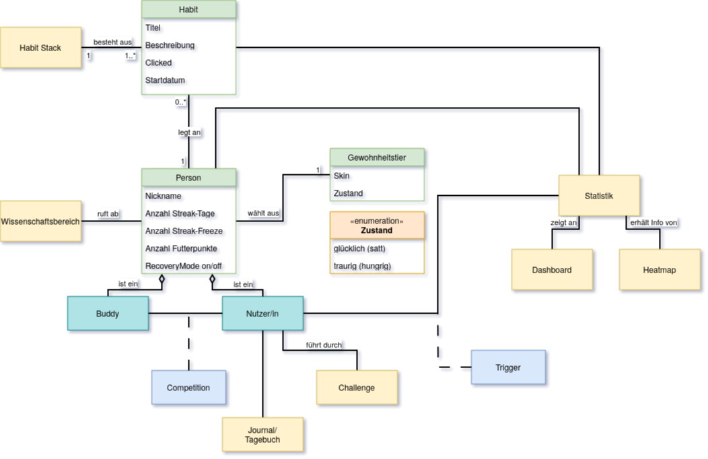

= Glossar: {project-name}
include::../_includes/default-attributes.inc.adoc[]

include::../_includes/teammitglieder.adoc[]

{localdatetime}
// Platzhalter für weitere Dokumenten-Attribute

== Einführung
In diesem Dokument werden die wesentlichen Begriffe aus dem Anwendungsgebiet (Fachdomäne) der Habit-Tracker definiert. Zur besseren Übersichtlichkeit sind Begriffe, Abkürzungen und Datendefinitionen gesondert aufgeführt.

== Begriffe
[%header]
|===
| Begriff | Definition und Erläuterung | Synonyme
//| Kommissionierung | Bereitstellung von Waren aus einem Lager entsprechend eines Kundenauftrags | (keine)
| Nutzer:in | Person, die {project-system-name} benutzt | User, Kunde
| Gewohnheit | Regelmäßig wiederholte Handlung, die automatisiert und ohne hohe Willenskraft ausgeführt wird. | Habit
| Avatar | Icon eines Tieres, das Emotionen zeigt und zum Durchhalten motiviert | Gewohnheitstier
| Buddy | Person, die den Nutzer regelmäßig nach Fortschritten fragt und so für Verbindlichkeit sorgt. | Accountability Partner
| Badge | Virtuelle Auszeichnung, die nach definierten Erfolgen (z. B. 7-Tage-Serie) vergeben wird, um Motivation zu steigern. |
| Calendar View | Kalenderansicht, in der tägliche Erledigungen (Check-ins) als farbige Markierungen erscheinen. |
| Eintrag | Manuelle oder automatische Bestätigung, dass eine Gewohnheit an einem Tag ausgeführt wurde. | Check-in 
| Cloud Backup | Automatische Sicherung der Habit-Daten in einer Cloud, um Gerätewechsel oder Datenverlust abzufangen. |
| Trigger | Auslösereiz im Habit-Loop, der den Nutzer an die Ausführung der Gewohnheit erinnert. | Cue
| Dashboard | Übersicht mit Kennzahlen (Streak-Länge, Erfolgsquote, Heatmap) zur Fortschrittskontrolle. |  Analytics
| Dark Mode | Farbschema mit dunklem Hintergrund zur besseren Lesbarkeit bei wenig Umgebungslicht. |
| Data Sync | Abgleich der Habit-Daten zwischen mehreren Geräten oder Diensten in Echtzeit. |
| Frequency (Frequenz) | Anzahl der benötigten Ausführungen einer Gewohnheit pro Zeitraum (z. B. „3×/Woche“). |
| Gamification | Einsatz spieltypischer Elemente (Badges, Level, Ranglisten) zur Steigerung von Engagement und Motivation. |
| Challenge | |
| Habit Loop | Modell aus Cue → Routine → Reward, das den Entstehungs- und Verstärkungsprozess einer Gewohnheit beschreibt. |
| Habit Stacking | Methode, bei der eine neue Gewohnheit direkt an eine bestehende gekoppelt wird („nach dem Zähneputzen meditieren“). |
| Heatmap | Farb¬kodierte Matrix, die zeigt, an welchen Tagen/Wochen eine Gewohnheit erfüllt wurde (je dunkler, desto häufiger). |
| Leaderboard | Vergleichende Darstellung der Fortschritte mehrerer Nutzer zur Förderung eines Wettkampfeffekts. | Rangliste
| Micro-interaction | Kleine, zielgerichtete Interaktion (z. B. Tipp auf ein Häkchen-Icon), die unmittelbares Feedback liefert. |
| Onboarding | Geführter Erst-Setup-Prozess, in dem der Nutzer Gewohnheiten anlegt und App-Funktionen kennenlernt. |
| Datenschutzeinstellungen | Optionen zur Steuerung, welche Gewohnheiten, Erinnerungen oder Statistiken gespeichert, geteilt oder anonymisiert werden. | Privacy Settings
| Fortschrittsbalken | Balken, der den prozentualen Fortschritt einer Gewohnheit oder eines Ziels visualisiert. | Progress Bar
| Erinnerung | Zeit- oder ortsbasierte Benachrichtigung, die den Nutzer zum Check-in auffordert. | Push Notification
| Belohnung | Positive Verstärkung (z. B. visuelles Feuerwerk, Badge, eigene Erlaubnis), die nach Ausführung folgt. | Reward
| SMART Goal | Ziel, das Spezifisch, Messbar, Attraktiv, Realistisch, Terminiert formuliert ist; Grundlage vieler Habit-Formulierungen. |
| Streak | Ununterbrochene Abfolge erfolgreicher Check-ins; gilt als wichtiger Motivationsfaktor. | Serie
| Streak Freeze | Feature, das erlaubt, eine Streak bei einmaligem Verpassen (z. B. Krankheit) „einzufrieren“, um Demotivation zu verhindern. |
| Widget | Mini-Ansicht (z. B. auf dem Homescreen), die schnelle Check-ins oder Fortschrittsanzeigen ermöglicht. |
|===

== Abkürzungen und Akronyme
[%header]
|===
| Abkürzung | Bedeutung | Erläuterung
//| UP | Unified Process | Vorgehensmodell für die Softwareentwicklung
| xx | xx | xx
|===

== Verzeichnis der Datenstrukturen
[%header]
|===
| Bezeichnung | Definition | Format | Gültigkeitsregeln | Aliase

| Anmeldedaten
| Zusammensetzung von Benutzername und Passwort.
| String
| Emailadresse muss `@`-Zeichen und `.` Punkt enthalten.
| Login

| xx
| xx
| xx
| xx
| xx
|===

== Domänenmodell
// Fügen Sie hier eine Abbildung mit ihrem Domänenmodell ein

